# ⚡ Vibe Code Rescue

> **The definitive Senior Engineer audit, repair, and production-readiness framework for AI-assisted ("vibe coded") applications.**

---

## 🧐 What is Vibe Code Rescue?

AI coding assistants are incredible at rapid prototyping, but they frequently leave behind subtle landmines:
- ❌ **Fake / Dummy Data:** `setTimeout` mocks, hardcoded arrays, and static counters pretending to be real features.
- ❌ **Dead Interactive Elements:** Buttons with no `onClick`, unpersisted toggles, and form submissions that don't save to the database.
- ❌ **Disconnected Backend Flows:** Frontend components expecting response shapes the backend doesn't return.
- ❌ **Security & Tenant Leaks:** Missing Row Level Security (RLS), broken authorization guards, and exposed credentials.
- ❌ **Abandoned Partial Features:** Features that render visually but break on refresh or edge cases.

**Vibe Code Rescue** is a structured, modular prompt suite and verification engine that forces AI coding agents to perform forensic technical audits, eliminate fake implementations, connect real database mutations, and polish user experience until your project is genuinely **production-ready**.

---

## 🗺️ 5-Stage Execution Framework

```mermaid
flowchart LR
    subgraph S1["🩺 Stage 1: Diagnose"]
        D1[01 Codebase Audit]
        D2[02 Dummy Data]
        D3[03 UI Functionality]
        D4[04 DB & Backend]
        D5[05 Auth & Security]
    end

    subgraph S2["🔧 Stage 2: Repair"]
        R1[11 Error Resilience]
        R2[12 Security & IDOR]
        R3[13 Performance]
        R4[14 Accessibility]
        R5[15 Responsive]
    end

    subgraph S3["🏗️ Stage 3: Build & Complete"]
        B1[16 Feature Inventory]
        B2[17 Deep Verification]
        B3[18 Implementation Engine]
        B4[21 Zero-Defect Pass]
    end

    subgraph S4["🎨 Stage 4: Experience & Polish"]
        E1[22 UI/UX Design]
        E2[23 Assets & Icons]
        E3[24 Motion & Micro]
        E4[25 PWA & Offline]
        E5[28 Final Polish]
    end

    subgraph S5["📚 Stage 5: Standards & Docs"]
        DOC1[29 Documentation]
        DOC2[30 AI Rules]
    end

    S1 --> S2 --> S3 --> S4 --> S5
```

---

## 🚀 Quick Start: How to Use

### 1. The Senior Engineer Full Rescue (Fastest Method)
To perform an end-to-end rescue on any repository in one go:
1. Open your AI coding assistant (**Cursor Composer**, **Windsurf Cascade**, **Claude Code**, **Google Antigravity**, or **ChatGPT Canvas**).
2. Copy and paste the entire contents of [`prompts/MASTER_REPAIR.md`](./prompts/MASTER_REPAIR.md).
3. The AI agent will execute all 9 phases autonomously:
   $$\text{Understand} \to \text{Inventory} \to \text{Diagnose} \to \text{Prioritize} \to \text{Repair} \to \text{Complete} \to \text{Verify} \to \text{Regression Check}$$

---

### 2. Targeted Modular Audits
For surgical fixes on specific subsystems, choose the relevant prompt from the catalog:

| Need | Run This Prompt |
|------|-----------------|
| Catch broken imports & runtime crashes | [`prompts/stage-1-diagnose/01-codebase-technical-audit.md`](./prompts/stage-1-diagnose/01-codebase-technical-audit.md) |
| Hunt down hardcoded arrays & mock delays | [`prompts/stage-1-diagnose/02-dummy-data-audit.md`](./prompts/stage-1-diagnose/02-dummy-data-audit.md) |
| Fix dead buttons & non-functional forms | [`prompts/stage-1-diagnose/03-ui-functionality-audit.md`](./prompts/stage-1-diagnose/03-ui-functionality-audit.md) |
| Generate canonical Supabase SQL source-of-truth | [`supabase/01-source-of-truth-generator.md`](./supabase/01-source-of-truth-generator.md) |
| Convert app into an installable PWA | [`prompts/stage-4-experience-and-polish/25-pwa-conversion.md`](./prompts/stage-4-experience-and-polish/25-pwa-conversion.md) |

---

## 🗂️ Complete Prompt Catalog

### Master Orchestrator
- [`prompts/MASTER_REPAIR.md`](./prompts/MASTER_REPAIR.md) — Full 9-phase Senior Engineer repository rescue.

### 🩺 Stage 1 — Diagnose
- [`01-codebase-technical-audit.md`](./prompts/stage-1-diagnose/01-codebase-technical-audit.md) — Comprehensive technical health check.
- [`02-dummy-data-audit.md`](./prompts/stage-1-diagnose/02-dummy-data-audit.md) — Elimination of mock arrays, fake counters & simulation logic.
- [`03-ui-functionality-audit.md`](./prompts/stage-1-diagnose/03-ui-functionality-audit.md) — Interactive element inspection & handler repair.
- [`04-database-backend-audit.md`](./prompts/stage-1-diagnose/04-database-backend-audit.md) — Database schema, queries, mutations & RLS alignment.
- [`05-auth-security-audit.md`](./prompts/stage-1-diagnose/05-auth-security-audit.md) — Authentication, role guards & user data isolation.
- [`06-comprehensive-system-audit.md`](./prompts/stage-1-diagnose/06-comprehensive-system-audit.md) — End-to-end full system audit & test plan.
- [`07-architecture-mapping.md`](./prompts/stage-1-diagnose/07-architecture-mapping.md) — Architecture mapping & dependency graph.
- [`08-environment-setup-audit.md`](./prompts/stage-1-diagnose/08-environment-setup-audit.md) — Clean-clone onboarding & build pipeline check.
- [`09-dependency-audit.md`](./prompts/stage-1-diagnose/09-dependency-audit.md) — Dependency cleanup, bloat reduction & peer conflict fixes.
- [`10-api-contract-audit.md`](./prompts/stage-1-diagnose/10-api-contract-audit.md) — Frontend expectation vs. backend API contract audit.

### 🔧 Stage 2 — Repair
- [`11-error-resilience-audit.md`](./prompts/stage-2-repair/11-error-resilience-audit.md) — Failure modes, loading/error/empty state hardening.
- [`12-security-audit.md`](./prompts/stage-2-repair/12-security-audit.md) — Security vulnerabilities, IDOR, XSS & client secret checks.
- [`13-performance-audit.md`](./prompts/stage-2-repair/13-performance-audit.md) — Query optimization, bundle size, re-renders & memory leaks.
- [`14-accessibility-audit.md`](./prompts/stage-2-repair/14-accessibility-audit.md) — Keyboard navigation, focus management & screen readers.
- [`15-responsive-design-audit.md`](./prompts/stage-2-repair/15-responsive-design-audit.md) — Viewport responsiveness across mobile, tablet, and desktop.

### 🏗️ Stage 3 — Build & Complete
- [`16-master-feature-inventory.md`](./prompts/stage-3-build-and-complete/16-master-feature-inventory.md) — Master feature discovery & status categorization.
- [`17-deep-feature-verification.md`](./prompts/stage-3-build-and-complete/17-deep-feature-verification.md) — 17-point lifecycle verification of every feature.
- [`18-feature-implementation-engine.md`](./prompts/stage-3-build-and-complete/18-feature-implementation-engine.md) — Systematic implementation of unfinished features.
- [`19-partial-feature-completion.md`](./prompts/stage-3-build-and-complete/19-partial-feature-completion.md) — 5-tier completion pass for partial features.
- [`20-feature-discovery-pass.md`](./prompts/stage-3-build-and-complete/20-feature-discovery-pass.md) — Discovery of abandoned or hidden functionality.
- [`21-zero-defect-feature-pass.md`](./prompts/stage-3-build-and-complete/21-zero-defect-feature-pass.md) — Final zero-unfinished-features completion pass.

### 🎨 Stage 4 — Experience & Polish
- [`22-ui-ux-design-audit.md`](./prompts/stage-4-experience-and-polish/22-ui-ux-design-audit.md) — UI consistency, typography, spacing & design system.
- [`23-icons-and-visual-assets.md`](./prompts/stage-4-experience-and-polish/23-icons-and-visual-assets.md) — Icon library strategy (Lucide) & Lottie assets.
- [`24-animation-and-microinteractions.md`](./prompts/stage-4-experience-and-polish/24-animation-and-microinteractions.md) — Motion system, transitions & reduced-motion respect.
- [`25-pwa-conversion.md`](./prompts/stage-4-experience-and-polish/25-pwa-conversion.md) — Web App Manifest, Service Worker & offline shell.
- [`26-mobile-experience-pass.md`](./prompts/stage-4-experience-and-polish/26-mobile-experience-pass.md) — Mobile-first touch ergonomics & safe areas.
- [`27-user-journey-audit.md`](./prompts/stage-4-experience-and-polish/27-user-journey-audit.md) — Frictionless first-visit to returning-user journeys.
- [`28-final-production-polish.md`](./prompts/stage-4-experience-and-polish/28-final-production-polish.md) — Micro-spacing, polish & elimination of AI roughness.

### 📚 Stage 5 — Standards & Docs
- [`29-project-documentation-generator.md`](./prompts/stage-5-standards-and-docs/29-project-documentation-generator.md) — Code-accurate docs generation.
- [`30-ai-rules-generator.md`](./prompts/stage-5-standards-and-docs/30-ai-rules-generator.md) — Creates permanent `AI_RULES.md` operating instructions.

### 🗄️ Supabase Database Engine
- [`supabase/01-source-of-truth-generator.md`](./supabase/01-source-of-truth-generator.md) — Generates canonical `schema.sql`, `rls.sql`, `functions.sql`, `storage.sql`.
- [`supabase/02-sql-verification.md`](./supabase/02-sql-verification.md) — Independent SQL verification & multi-tenant isolation check.
- [`supabase/03-clean-db-setup-test.md`](./supabase/03-clean-db-setup-test.md) — Fresh database installation dependency test.
- [`supabase/04-complete-resynchronization.md`](./supabase/04-complete-resynchronization.md) — Codebase & Supabase schema re-synchronization.

---

## 🛠️ Assistant Compatibility

This framework is tested and optimized for:
- 🟢 **Cursor** (`Cmd+K`, `Composer`, Agent mode)
- 🟢 **Windsurf Cascade**
- 🟢 **Claude Code CLI** / **Claude 3.7 Sonnet**
- 🟢 **Google Antigravity IDE**
- 🟢 **GitHub Copilot Workspace**
- 🟢 **ChatGPT Canvas / Projects**

---

## 📄 License

This project is licensed under the [MIT License](./LICENSE).
