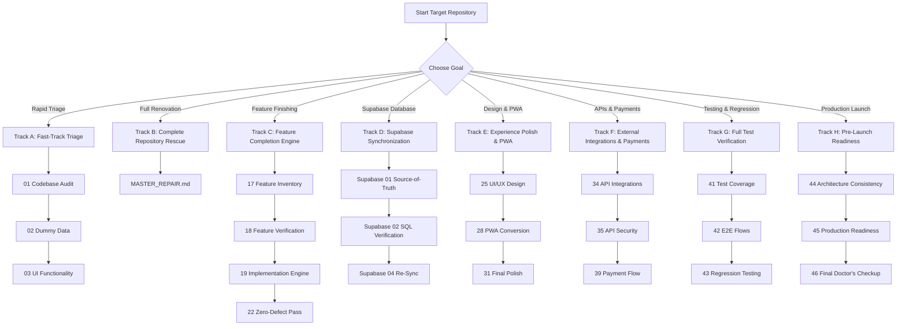

# VibeMedic: Execution Guide

This guide details how to execute VibeMedic prompts with AI coding agents (Cursor, Windsurf, Claude Code, Antigravity, ChatGPT, Copilot, etc.) to achieve maximum reliability and zero regressions.

---

## The Golden Rules of Execution

1. **One Focus at a Time**: Never paste multiple audit prompts simultaneously into the same conversation turn unless running the dedicated `MASTER_REPAIR.md` orchestrator.
2. **Review Before Execution**: When running an audit prompt, let the agent diagnose and present the report first before asking for heavy structural refactors.
3. **Always Run the Verification Pipeline**: Every prompt instructs the agent to run type checking, linting, tests, and builds before concluding. Ensure the agent actually executes terminal commands.
4. **Treat the Codebase as Ground Truth**: Do not let the agent invent features, mock APIs, or use hardcoded arrays.

---

## Workflow Tracks

---

## Track A: Fast-Track Triage (15-30 Minutes)
*Best for: Quick diagnostic check on an AI-generated MVP before presenting.*

1. **`prompts/stage-1-diagnose/01-codebase-technical-audit.md`** — Catches broken imports, syntax errors, and missing files.
2. **`prompts/stage-1-diagnose/02-dummy-data-audit.md`** — Identifies hardcoded arrays, mock counters, and fake setTimeout calls.
3. **`prompts/stage-1-diagnose/03-ui-functionality-audit.md`** — Fixes dead buttons, unhooked toggles, and empty handlers.

---

## Track B: Complete Senior Engineer Rescue (1-2 Hours)
*Best for: Inherited codebases, chaotic multi-agent repos, or pre-production readiness.*

1. **`prompts/MASTER_REPAIR.md`** — Runs all 9 phases autonomously:
   - Understand → Inventory → Diagnose → Prioritize → Repair → Complete Features → Verify → Regression Check → Final Report.

---

## Track C: Feature Discovery & Completion Engine
*Best for: Applications where half the features were started but left incomplete.*

1. **`prompts/stage-3-build-and-complete/17-master-feature-inventory.md`** — Discovers all intended features.
2. **`prompts/stage-3-build-and-complete/18-deep-feature-verification.md`** — Traces full 17-point lifecycle for each feature.
3. **`prompts/stage-3-build-and-complete/19-feature-implementation-engine.md`** — Implements unfinished features end-to-end.
4. **`prompts/stage-3-build-and-complete/20-partial-feature-completion.md`** — Closes all partial feature gaps.
5. **`prompts/stage-3-build-and-complete/22-zero-defect-feature-pass.md`** — Final verification pass.
6. **`prompts/stage-3-build-and-complete/23-dead-code-dependency-audit.md`** — Prunes unused code and unreferenced exports.

---

## Track D: Supabase Database Synchronization
*Best for: Ensuring your PostgreSQL / Supabase schema, RLS, and storage match the frontend code 100%.*

1. **`supabase/01-source-of-truth-generator.md`** — Scans frontend and generates `schema.sql`, `rls.sql`, `functions.sql`, `storage.sql`.
2. **`supabase/02-sql-verification.md`** — Verifies multi-user tenant isolation and PostgreSQL syntax.
3. **`supabase/03-clean-db-setup-test.md`** — Validates clean dependency-order execution for new environments.
4. **`supabase/04-complete-resynchronization.md`** — Re-syncs after any major feature additions.

---

## Track E: Design System, Mobile & PWA Polish
*Best for: Transforming a clunky AI app into a slick, responsive, installable product.*

1. **`prompts/stage-4-experience-and-polish/25-ui-ux-design-audit.md`** — Standardizes spacing, typography, and card primitives.
2. **`prompts/stage-4-experience-and-polish/26-icons-and-visual-assets.md`** — Implements Lucide icons and clean asset paths.
3. **`prompts/stage-4-experience-and-polish/27-animation-and-microinteractions.md`** — Adds micro-interactions and smooth transitions.
4. **`prompts/stage-4-experience-and-polish/28-pwa-conversion.md`** — Creates web app manifest, service worker, and offline mode.
5. **`prompts/stage-4-experience-and-polish/29-mobile-experience-pass.md`** — Ergonomic mobile layout and touch target audit.
6. **`prompts/stage-4-experience-and-polish/31-final-production-polish.md`** — Eliminates all remaining visual rough edges.

---

## Track F: Third-Party APIs, Webhooks & Payments
*Best for: Hardening provider integrations, webhook signatures, and financial transactions.*

1. **`prompts/stage-6-api-integrations/34-api-integration-audit.md`** — Replaces mock APIs with verified integrations.
2. **`prompts/stage-6-api-integrations/35-api-security-audit.md`** — Eliminates client-side secret leaks.
3. **`prompts/stage-6-api-integrations/37-webhook-audit.md`** — Verifies webhook signature validation & idempotency.
4. **`prompts/stage-7-payments/39-payment-flow-audit.md`** — Verifies payment initiation, callbacks, and database grants.

---

## Track G: Testing & Regression Suite
*Best for: Establishing solid test coverage and verifying zero post-repair regressions.*

1. **`prompts/stage-9-testing/41-test-coverage-critical-path-audit.md`** — Authors tests for critical user journeys.
2. **`prompts/stage-9-testing/42-end-to-end-user-flow-verification.md`** — Tests edge journeys and failure states.
3. **`prompts/stage-9-testing/43-regression-testing-after-repairs.md`** — Runs full regression pass.

---

## Track H: Pre-Launch Readiness & Final Doctor's Checkup
*Best for: Final verification before launching or presenting to stakeholders.*

1. **`prompts/stage-10-architecture/44-architecture-consistency-audit.md`** — Standardizes data fetching and error patterns.
2. **`prompts/stage-11-production/45-production-readiness-audit.md`** — Launch readiness scorecard across all operational pillars.
3. **`prompts/stage-11-production/46-final-doctors-checkup.md`** — Final non-destructive ship/don't ship verdict.
